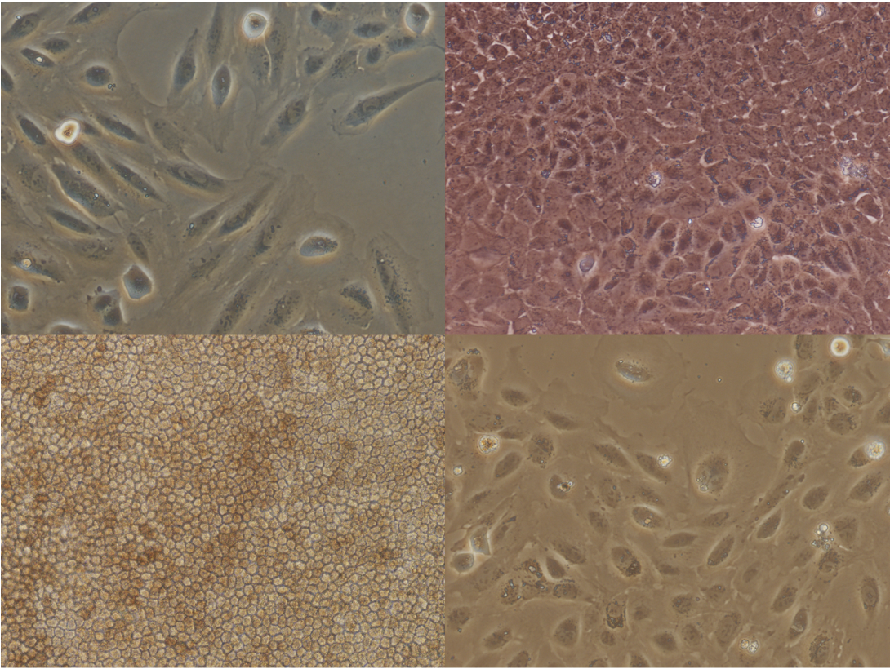
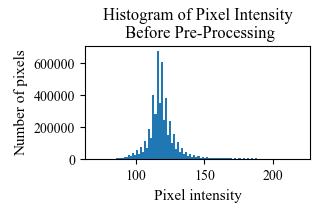
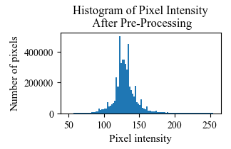
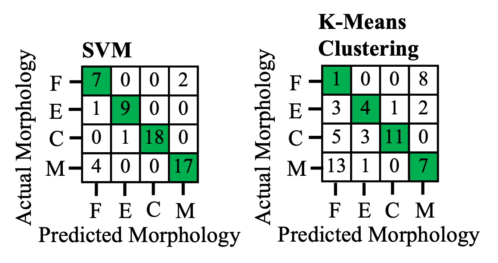

# Cell Image Analysis Pipeline

## Overview
This repository contains the pipeline developed for the UCL Mechanical Engineering Third Year Project titled, "Automated Processing of Cell Images Using the Discrete Wavelet Transform and Machine Learning".

This project involved designing a pipeline for automated cell image analysis, including: pre-processing, cell identification, cell counting, and cell maturity classification.

The pipeline has been developed and tested using Retinal pigment epithelium (RPE) cell images, and the BioMediTech RPE published dataset has been specifically used. Credit is given to the following paper for the RPE cell dataset: L. Nanni, M. Paci, F. L. C. Santos, H. Skottman, K. Juuti-Uusitalo, J. Hyttinen, Texture descriptors ensembles enable image-based classification of maturation of human stem cell-derived retinal pigmented epithelium, Plos One 2016.

This dataset is publicly available at: https://figshare.com/articles/dataset/BioMediTech_RPE_dataset/2070109

An example image of each cell morphology contained within the dataset is shown at the top of this file.

**Note: The full dataset should be downloaded and added within the `dataset` folder before commencing classiciation. The full dataset is not included within the repository due to maximum file size limitations.**

## Setup and Configuration Instructions
1. Download and open the full repository within an IDE.
2. Copy the full dataset of interest into the folder named `Dataset`. (The BioMediTech RPE dataset cited above can be used or alternate cell data, but this may require parameter adjustment)
   - Note: Some sample images are included within the `Dataset` extracted from the BioMediTech RPE dataset. Please replace these with the full dataset before attempting classification to replicate the results achieved.
3. Install the code by entering `pip install -e .` into the command line.
4. Install the depdencies by entering `pip install -r requirements.txt` into the command line.
5. Run either `Cell_Counting.py`, `Cell_Classification.py` or `DWT_Performance.py` files (an overview of each file's functionality is provided below).
6. For specific applications, e.g. only running the Elbow or Silhouette methods, please specify the function required when prompted in the terminal. Further details can be found in the `main` function body.
   - Note: The SVM visualisation of decision boundaries in `Cell_Classification.py` is only made available if the dataset used is less than 200 images, otherwise the computational run time required is very long.
7. Docstring comments are provided under each function describing its purpose.

## Python Files
Below a list is provided for the different functionality available within each Python file contained within the repository.
1. `Cell_Counting.py`
   - Note: The images already made available in the `dataset` folder are suitable for this task.
   1. Dynamic Range adjustment algorithm
   2. DWT based multiresolution analysis for denoising
   3. Binarisation thresholding
   4. Morphological operation application
   5. Contour identification
   6. Cell mapping
2. `Cell_Classification.py`
   1. DWT decomposition is completed using a specified wavelet function to generate DWT coefficients
   2. Statistical features are extracted from both raw pixel values and DWT decomposition coefficients
   3. SVM cell classification (supervised ML, therefore, labelled data is required)
   4. Confusion Matrix output demonstrating which morphology clusters have misprediction
   5. SVM decision boundary visualistation (which completes 2 parameter classification)
   6. Elbow and Silhouette methods for optimal number of clusters determination</li>
   7. K-means clustering cell classification (unsupervised ML, therefore, labelled data not required)
3. `DWT_Performance.py`
   - Following metrics are calculated for different DWT wavlet functions and vanishing moments:
   1. Structural Similarity Index Measure (SSIM)
   2. Peak Signal-to-Noise Ratio (PSNR)
   3. Computational time calculation for different DWT functions and vanishing moments

## Results Achieved
The following results have been achieved when the full RPE dataset has been used during testing.
1. This pre-processing method has achieved a `36.85%` improvement in dynamic range.
2. The cell counting method has achieved a `95.86%` accuracy for mixed morphology RPE cell images.
3. The SVM supervised machine learning classification has achieved a `95.53%` accuracy for cell maturity classification when applying DWT based multiresolution analysis.

A histogram before and after the pre-processing algorithm application is shown below.

An example of the cell identification and mapping achieved for a fusiform morphology RPE cell image is shown below.

An example of the cell identification and mapping achieved for a mixed morphology RPE cell image is shown below.

The confusion matrix generated for the cell morphology classification using the SVM classier is shown below on the left, and the confusion matrix for the k-means clustering classifer is shown below on the right.

